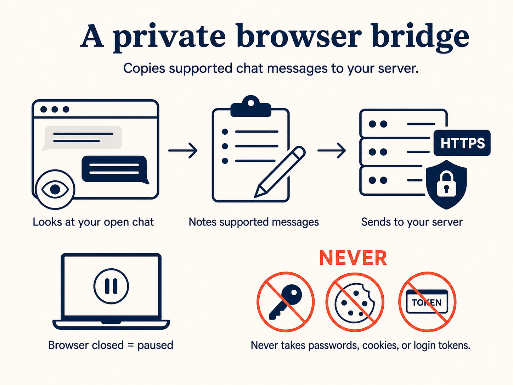

# Omnichat Browser Bridge

**A user-controlled bridge between a chat open in Chrome and an HTTPS server
you choose.**

The extension observes supported messages, keeps a small local delivery queue,
and forwards message batches to your server. It can also carry an online
plain-text reply back to the open chat. It is the **bridge** - not a hosted bot,
an official provider API, or a service that logs in for you.

> [!IMPORTANT]
>
> - **This project is not affiliated with or endorsed by Shopee, LINE, or any
>   other messaging provider.**
> - Browser-assisted access may conflict with a provider's terms or trigger
>   warnings, restrictions, or account suspension.
> - Use it only with an account you own or are authorized to operate. Obtain
>   any required customer consent and protect the data received by your server.
> - Provider pages and internal chat behavior can change without notice and
>   break the extension.
> - Review the source, start with a test account, limit the data you collect,
>   and stop if the provider objects. You can also review the
>   [source and risk notes in NotebookLM](https://notebooklm.google.com/notebook/d4a77915-88d3-4960-b589-bd10b8784f36).
>
> This is not legal advice. You are responsible for evaluating the terms,
> privacy rules, and risk that apply to your use.

## How it works

The provider chat stays in the user's browser. The extension reads supported
events from that open chat, stores unsent items locally, and delivers signed
batches over HTTPS. For an optional live reply, your server wakes the connected
extension over WebSocket; the extension types into the matching open
conversation and immediately returns success or an error.

## A simple analogy

Imagine a helpful assistant sitting beside you 👀. They read the open chat,
write the useful parts in your chosen notebook 📝, and can type a reply when
you ask 📤.

The extension is the **bridge** 🌉. It is **not** the shop, the notebook, or a
remote person holding your keys. When Chrome is closed, the bridge is closed
too. No tiny robot keeps working overnight 🤖💤.

## What we do and do not do

- ✅ Observe supported messages in an open provider chat.
- ✅ Queue unsent messages and sync cursors in extension-local storage.
- ✅ Import or export one configuration file containing multiple shop accounts.
- ✅ Send HMAC-signed message batches to the HTTPS server you configure.
- ✅ Attempt recovery of recent messages after the browser returns.
- ✅ Support an optional online plain-text reply to the matching open chat.
- ❌ Never save or transfer provider passwords, cookies, login tokens, or
  browser credentials.
- ❌ Never work while Chrome or the required provider page is unavailable.
- ❌ Never promise official API status, uninterrupted operation, or freedom
  from provider enforcement.
- ❌ Never queue live replies remotely for later delivery.

## Supported providers

| Provider | Status | Guide |
| --- | --- | --- |
| Shopee Seller Chat | Supported | [Setup and behavior](docs/providers/shopee.md) |
| LINE Official Account | Under development | - |

## Contributing

Issues and pull requests are welcome. Before changing delivery or reply
behavior, read:

- [Technical debt, architecture, and contracts](docs/technical-debt.md)
- [Message batch contract](docs/payload-contract.md)
- [Shopee provider guide](docs/providers/shopee.md)

Please keep provider adapters isolated, preserve the credential boundary, and
document every contract change.

## License

[MIT](LICENSE)
