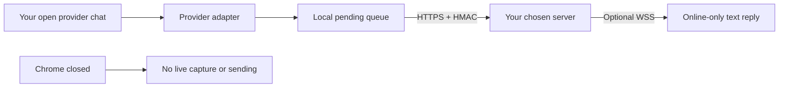

# Omnichat Realtime Bridge

Open-source browser extension for syncing messages from supported messaging and
marketplace providers to an HTTPS server you choose.

> [!IMPORTANT]
>
> - **NOT affiliated with or endorsed by any platform,** e.g. Shopee, LINE
> - **Your provider account may be at risk.** Policy enforcement may lead to
>   warnings, restrictions, or suspension.
> - Review the [source and risk in NotebookLM](https://notebooklm.google.com/notebook/d4a77915-88d3-4960-b589-bd10b8784f36).
>   This is not legal advice.

Use it **only for an account you own or are authorized to operate**. Protect
customer data and stop if the provider asks you to stop.

## Supported providers

The architecture is provider-oriented. The current extension build supports:

| Provider | Status | Guide |
| --- | --- | --- |
| Shopee Seller Chat | Supported | [How Shopee sync works](docs/providers/shopee.md) |
| LINE Official Account | Under development | — |

## How it works

Think of it as an assistant working on your behalf: while provider chat is open,
it watches the same messages, copies supported fields, and passes them to your
chosen server.

It **does NOT save or send your provider password, cookies, or login tokens**.
With Chrome closed or the laptop off, **nothing is captured or sent**. A
provider adapter may recover missed messages when you return.

## Shared delivery behavior

- Sends the [`omnichat.message_batch` version 1 contract](docs/payload-contract.md).
- Advances each conversation cursor only after server acknowledgement.
- Keeps pending messages and sync cursors in extension-local storage.
- Optional live reply uses a short-lived ticket and WebSocket presence only. It
  stores no command or message text remotely.
- A reply is accepted only while the configured seller browser is online and
  has the matching Shopee conversation open.

Provider-specific capture, recovery, data fields, and setup are documented in
each provider guide.

## License

[MIT](LICENSE)
