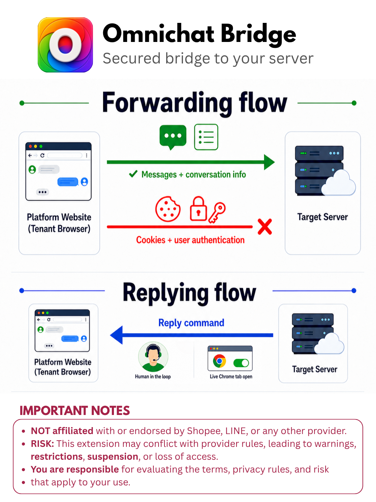

# Omnichat Bridge

**Omnichat Bridge is an open-source Chrome extension that helps shops stay
available by bringing scattered platform chats into one workflow.**

From an open Chrome chat tab, it **forwards messages** from supported platforms
(such as **Shopee**; **LINE Official Account** is in development) to your chosen server, where your team can work from one place WITHOUT taking browser credentials. Since this tool is *open-source*, its code and behavior are transparent for you to review or use [NotebookLM](https://notebooklm.google.com/notebook/d4a77915-88d3-4960-b589-bd10b8784f36) to scrutinize the design and risks or read more on the [Privacy Policy](PRIVACY.md).

It works like like a **coppilot**, require **human-in-the-loop**, not a hosted bot.

> [!IMPORTANT]
> - **NOT affiliated with or endorsed by Shopee, LINE, or any other provider.**
> - ⚠️ RISK: This extension may conflict with provider rules, leading to
>   warnings, restrictions, suspension, or loss of access.
> - You are responsible for evaluating the terms, privacy rules, and risk that apply to your use.

## How it works

The provider chat stays in the user's browser. The extension reads supported
events from that open chat, stores unsent items locally, and delivers signed
batches over HTTPS. For an optional live reply, your server wakes the connected
extension over WebSocket; the extension types into the matching open
conversation and immediately returns success or an error.

## A simple analogy

Imagine a helpful assistant sitting beside you 👀. They read the open chat,
write the useful parts in your chosen notebook 📝, and can type a reply when
you ask 📤.

- ✅ The extension is the **bridge** 🌉, a **co-pilot**.
- ❌ This extension is **NOT** the shop, the notebook, or a
remote person holding your keys.

When Chrome is closed, the bridge is closed too. No tiny robot keeps working overnight 🤖💤.

## What we do and do not do

- ✅ DO send message securely to the server you configure.
- ✅ DO queue unsent and attempt after the browser returns.
- ❌ NEVER save or transfer provider passwords, cookies, login tokens, or
  browser credentials.
- ❌ NEVER work while Chrome or the required provider page is unavailable.

## Supported providers

| Provider | Status | Guide |
| --- | --- | --- |
| Shopee Seller Chat | Supported | [Setup and behavior](docs/providers/shopee.md) |
| LINE Official Account | Under development | - |

## Contributing

Issues and pull requests are welcome. Before changing delivery or reply
behavior, read:

- [Technical debt, architecture, and contracts](docs/technical-debt.md)
- [Message batch contract](docs/payload-contract.md)
- [Shopee provider guide](docs/providers/shopee.md)

Please keep provider adapters isolated, preserve the credential boundary, and
document every contract change.

## License

[MIT](LICENSE)
