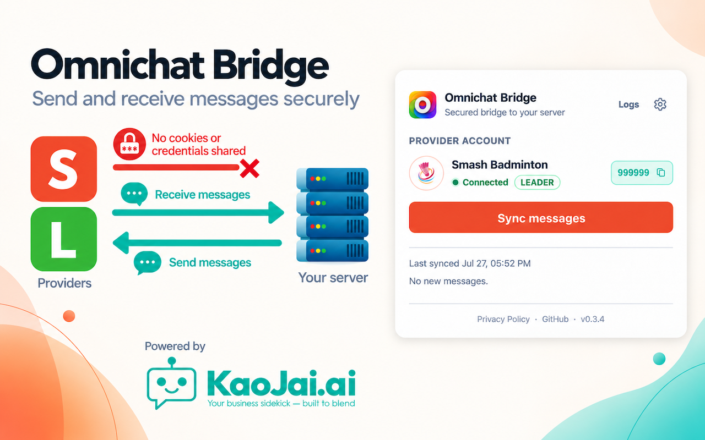
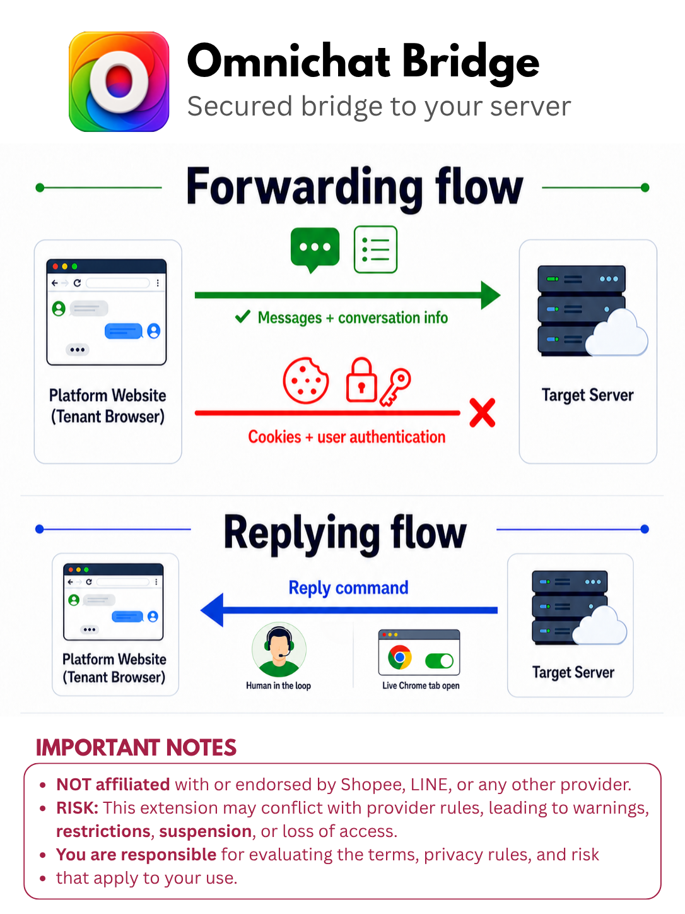

# Omnichat Bridge



Powered by [KaoJai.ai](https://kaojai.ai).

<a href="https://kaojai.ai">
  
</a>

**An open-source Chrome extension that connects Shopee Seller Chat and LINE
Official Account chat to your chosen server.** Receive messages and send replies
through your signed-in browser without transferring provider passwords, cookies,
or login tokens. See the [Privacy Policy](PRIVACY.md).

[Install from the Chrome Web Store](https://chromewebstore.google.com/detail/omnichat-bridge/blfmmjdpjoimhnahjbcfimclhgmkjhkn)

## Setup (Shopee and LINE)

1. Install the extension and sign in to [Shopee Seller Centre](https://seller.shopee.co.th/)
   or [LINE OA Chat](https://chat.line.biz/). Keep the provider page open.
2. Open Omnichat Bridge, review the transfer disclosure, and consent.
3. In **Settings**, import or paste the configuration supplied by your server
   administrator, then **Save configuration** and allow access to its server URLs.
4. Select the provider account and click **Sync messages**. On Shopee Seller
   Centre, the first manual sync can open the Chat panel.

Both providers use the same version 3 configuration format. This example can
configure both in one file:

```json
{
  "version": 3,
  "accounts": [
    {
      "provider": "shopee",
      "provider_account_id": "123456789",
      "events_url": "https://your-server.example.com/omnichat/events",
      "api_url": "https://your-server.example.com/omnichat/api",
      "hmac_secret": "replace-with-server-issued-secret"
    },
    {
      "provider": "line_oa",
      "provider_account_id": "@example",
      "events_url": "https://your-server.example.com/omnichat/events",
      "api_url": "https://your-server.example.com/omnichat/api",
      "hmac_secret": "replace-with-server-issued-secret"
    }
  ]
}
```

Replace every example value with your server-issued configuration. Use the
Shopee **Shop ID** or LINE OA **Basic ID** matching the detected account.
`events_url` and `api_url` must use HTTPS; their actual paths depend on your
server. `hmac_secret` authenticates the bridge to your server and is **not a
provider login credential**. Optional `image_server_url` and `logs_url` also
require HTTPS. Preserve any additional LINE fields supplied by your server.
Existing Shopee version 2 configurations remain supported; LINE requires
version 3.

## How it works



The extension reads supported chat events, queues unsent items locally, and
sends HMAC-signed batches over HTTPS. For live replies, your server wakes the
extension over WebSocket and the browser sends through the matching provider
conversation. Chrome and the provider page must remain available; the bridge
cannot bypass sign-in or operate while Chrome is closed.

| Provider | Status | Details |
| --- | --- | --- |
| Shopee Seller Chat | Supported | [Provider behavior](docs/providers/shopee.md) |
| LINE Official Account | Supported | [Attachment behavior](docs/line-oa-attachments.md) |

## Demo

[](https://youtu.be/1jhDywbflmg)

## Provider notice

Not affiliated with or endorsed by Shopee, LINE, or other providers. Browser
integration may conflict with provider rules and lead to restrictions or loss
of access. Review the applicable terms before use.

## Contributing

Issues and pull requests are welcome. Read the [architecture](docs/technical-debt.md)
and [message contract](docs/payload-contract.md); keep adapters isolated and
preserve the credential boundary.

## License

[MIT](LICENSE)
