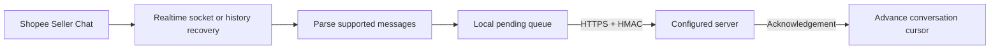

# Shopee provider

Shopee Seller Chat is the first supported provider.

## How it works

1. The seller signs in and opens Shopee Seller Chat.
2. The extension reads realtime messages from the existing authenticated chat
   socket.
3. For missed messages, it requests recent conversation history using the open
   Seller Chat session.
4. Supported messages enter a local pending queue.
5. The extension sends an HMAC-signed batch to the configured HTTPS server.
6. The local cursor advances only after the server acknowledges the batch.

See the shared [`omnichat.message_batch` v1 contract](../payload-contract.md).



The extension **does NOT save or send the seller's Shopee password, cookies, or
login tokens**. Request headers remain in the Shopee page's memory.

Chrome and the Seller Chat tab must remain open for realtime capture. When the
laptop or Chrome is off, nothing is captured or sent. Recovery may fetch missed
messages after the seller returns.

## Optional live replies

Your server can send one plain-text reply to the active seller browser. The
extension fills and submits Shopee's visible composer; it does not call a
Shopee private message API and never transfers Shopee cookies, passwords, or
login tokens.

- The target conversation must already be open in Seller Chat.
- If the browser is offline or another conversation is open, the server returns
  an error. There is no remote command queue or retry.
- The live service keeps only a short-lived connection ticket and browser
  presence record. It does not store message text.

## Recovery

- First recovery and **Sync messages**: 10 newest conversations, up to 25
  newest messages each.
- Resume with an existing cursor: no extension-imposed conversation or message
  cap.
- Conversations without a cursor: at most the last seven days.
- Resume cooldown: five minutes.
- Shopee requests are spaced by at least three seconds.

## Data sent

- Inbound and outbound text messages
- Supported image and video URLs
- Buyer IDs, display names, avatar URLs, and timestamps

## Local setup

1. Open `chrome://extensions` and enable **Developer mode**.
2. Select **Load unpacked** and choose the `extension/` folder.
3. Accept the disclosure and let the extension detect the Shop ID.
4. Open **Configure**, add the detected Shop ID or import a configuration file,
   and select **Sync messages**.

```json
{
  "version": 2,
  "accounts": [
    {
      "provider": "shopee",
      "provider_account_id": "shop-1",
      "events_url": "https://collector.example.com/omnichat/events",
      "commands_url": "https://admin.example.com/api/omnichat/tickets",
      "hmac_secret": "base64-secret"
    },
    {
      "provider": "shopee",
      "provider_account_id": "shop-2",
      "events_url": "https://collector.example.com/omnichat/events",
      "commands_url": "https://admin.example.com/api/omnichat/tickets",
      "hmac_secret": "another-base64-secret"
    }
  ]
}
```

Never commit a real connection setup. The destination server must map the
detected Shop ID to the same HMAC secret. Import replaces the complete saved
account list; export includes the HMAC secrets and must be stored securely.

See the main [safety and account-risk notice](../../README.md).
