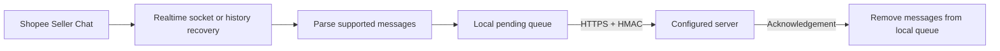

# Shopee provider

Shopee Seller Chat is the first supported provider.

## How it works

1. The seller signs in and opens Shopee Seller Chat.
2. The extension reads realtime messages from the existing authenticated chat
   socket.
3. For missed messages, it requests recent conversation history using the open
   Seller Chat session.
4. Supported messages enter a local pending queue.
5. The extension sends an HMAC-signed batch to the configured HTTPS server.
6. The local scan cursor advances after messages are durably queued in the
   extension. The queue removes them only after the server acknowledges the
   batch.

See the shared [`omnichat.message_batch` v1 contract](../payload-contract.md).



The extension **does NOT save or send the seller's Shopee password, cookies, or
login tokens**. Request headers remain in the Shopee page's memory.

Chrome and the Seller Chat tab must remain open for realtime capture. When the
laptop or Chrome is off, nothing is captured or sent. Recovery may fetch missed
messages after the seller returns.

## Optional live replies

Your server can send one text, image, or product reply to the active seller
browser. Text and image replies may quote an existing provider message. The
extension fills and submits Shopee's visible composer; it does not call a
Shopee private message API and never transfers Shopee cookies, passwords, or
login tokens.

- The target conversation must already be open in Seller Chat.
- If the browser is offline or another conversation is open, the server returns
  an error. There is no remote command queue or retry.
- The live service keeps only a short-lived connection ticket and browser
  presence record. It does not store message text.

## Sync and recovery

Bootstrap, resume, retry, and **Sync messages** use one checkpointed sync flow.

- Without a completed checkpoint, bootstrap reads the 10 newest conversations
  and at most 25 newest messages from each.
- With a checkpoint, sync follows every changed conversation back to its local
  cursor without an extension-imposed conversation or message cap.
- Conversation-list and message-history pages are requested sequentially.
- Every history page is saved to the local queue immediately. A conversation
  cursor advances only after all required pages for that conversation finish.
- Realtime capture starts only after bootstrap completes and pauses while a
  recovery scan is incomplete. The scan catches messages received during that
  window before realtime cursor advancement resumes.
- The global conversation-list watermark advances only after the complete scan
  finishes. An interrupted scan restarts discovery and skips work already
  covered by conversation cursors.
- Load, reconnect, and visible focus can resume sync at most once every five
  minutes. **Sync messages** and **Retry now** bypass that window.
- Failed collector delivery retries after approximately 1, 2, 5, 15, and 30
  minutes, capped at 30 minutes. Retry never calls Shopee.
- Shopee recovery requests are spaced by at least one second.

## Data sent

- Inbound and outbound text messages
- Supported image and video URLs
- Buyer IDs, display names, avatar URLs, and timestamps

## Local setup

1. Open `chrome://extensions` and enable **Developer mode**.
2. Select **Load unpacked** and choose the `extension/` folder.
3. Accept the disclosure and let the extension detect the available Shop IDs.
4. Open **Configure**, add or import the Shop IDs you want to sync, select a
   configured shop in the extension, and select **Sync messages**.

```json
{
  "version": 2,
  "accounts": [
    {
      "provider": "shopee",
      "provider_account_id": "shop-1",
      "events_url": "https://collector.example.com/omnichat/events",
      "commands_url": "https://admin.example.com/api/omnichat/tickets",
      "logs_url": "https://collector.example.com/omnichat/logs",
      "hmac_secret": "your-hmac-secret"
    },
    {
      "provider": "shopee",
      "provider_account_id": "shop-2",
      "events_url": "https://collector.example.com/omnichat/events",
      "commands_url": "https://admin.example.com/api/omnichat/tickets",
      "logs_url": "https://collector.example.com/omnichat/logs",
      "hmac_secret": "another-hmac-secret"
    }
  ]
}
```

`logs_url` is optional. When set, the extension sends sanitized operational
logs in signed HTTPS batches after **Sync messages** is selected. It never
includes message text, message bodies, cookies, browser credentials, HMAC
secrets, request headers, or URLs.

Never commit a real connection setup. The destination server must map each
detected Shop ID to the same HMAC secret. Import replaces the complete saved
account list; export includes the HMAC secrets and must be stored securely.
Shopee user IDs are display-only metadata and are never used as Shop IDs.

See the main [safety and account-risk notice](../../README.md).
