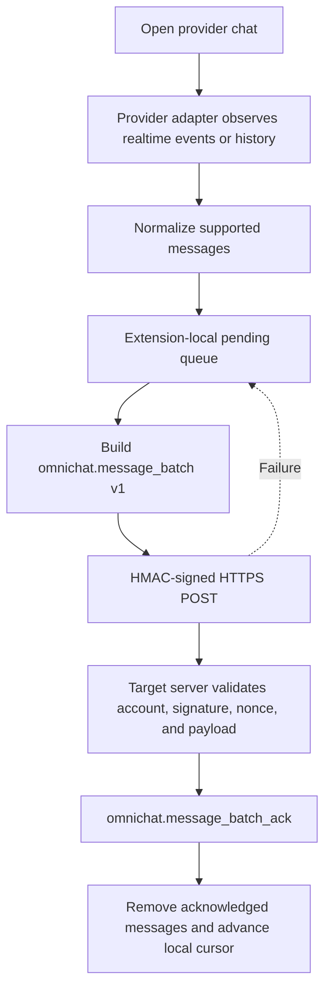
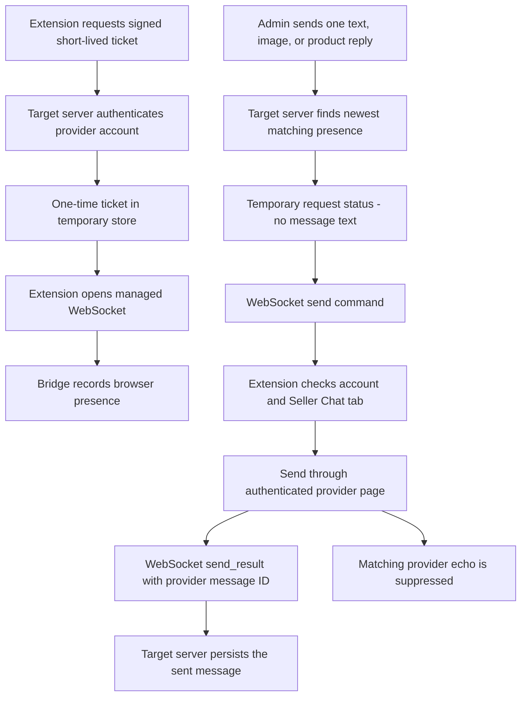

# Technical debt, architecture, and contracts

The bridge has two independent flows:

1. **Send observed messages to the target server.**
2. **Send a live reply from the target server back to the messaging provider.**

The current implementation supports Shopee first. Provider-specific capture
must stay behind an adapter; delivery and security contracts should remain
provider-neutral where practical.

## Flow 1: Send messages to the target server

### Architecture



The scan cursor represents what the extension has **durably persisted to its
local pending queue**, not a provider API cursor or collector acknowledgement.
Pending messages remain local until the target accepts or deduplicates the
whole batch. This keeps provider discovery independent from collector outages.

### Extension configuration contract

Configuration version 2 contains an `accounts` list. Each entry is uniquely
identified by `provider + provider_account_id` and owns its HMAC secret,
inbound destination, and outbound destination. See the
[multi-account example](providers/shopee.md#local-setup).

- `events_url` is the HTTPS message-batch receiver.
- `commands_url` is the HTTPS command-channel endpoint.
- `logs_url` is the optional HTTPS operational-log receiver.
- The ticket response supplies the WSS browser-presence URL.
- Import replaces the saved account list. Export includes HMAC secrets.
- Pending messages, cursors, status, and resume timing are partitioned by the
  same account identity.

### HTTP contract

The extension sends [`omnichat.message_batch` version 1](payload-contract.md):

```http
POST /omnichat/events
Content-Type: application/json
X-Omnichat-Provider-Account-Id: <provider account ID>
X-Omnichat-Timestamp: <ISO 8601 timestamp>
X-Omnichat-Nonce: <unique UUID>
X-Omnichat-Signature: <HMAC-SHA256 hex>
```

The signature covers the method, request path, timestamp, nonce, and SHA-256
hash of the exact body. The server acknowledges the matching `batch_id` and
reports accepted plus duplicate message counts. The extension removes those
messages from its local queue only when the counts cover every message sent.

### Current delivery limits

- 50 conversations per batch.
- 100 messages per conversation.
- 500 messages total per batch.
- 1 MiB request body.
- At most 10 batches in one flush.
- Configuration, consent, pending messages, installation ID, cursors, and
  48-hour operational logs live in `chrome.storage.local`.
- Failed delivery uses an account-scoped Chrome alarm with capped exponential
  backoff. Manual retry and normal resume reset the backoff.

### Technical debt

- **Provider behavior is brittle.** Shopee page, socket, or response changes can
  break capture and recovery without notice.
- **Local state has one device boundary.** Clearing extension storage loses the
  pending queue and acknowledged cursor. Multiple installations do not
  coordinate their cursors.
- **Media is referenced, not archived.** Provider image and video URLs may
  expire; the bridge does not upload a durable copy.
- **Recovery is best effort.** No capture happens while Chrome is closed. A
  later history scan may recover messages, but it cannot guarantee that the
  provider still exposes everything.
- **Contract checks are split across repositories.** A shared conformance suite
  should verify signing, limits, acknowledgement, deduplication, and schema
  compatibility against every target implementation.
- **One active account per browser context.** A version 2 configuration can
  contain multiple shops, and local delivery state is partitioned per shop, but
  the extension operates only the account that Shopee currently exposes in
  that Chrome profile.

## Flow 2: Reply back to the messaging provider

### Architecture



This flow is online-only. There is no remote command queue and no delayed
retry. The Admin request waits briefly for the browser result and fails when
the browser, account, or conversation is unavailable.

### Ticket contract

The extension authenticates the same provider account with HMAC:

```http
POST /api/omnichat/tickets
Content-Type: application/json
X-Omnichat-Provider-Account-Id: <provider account ID>
X-Omnichat-Timestamp: <ISO 8601 timestamp>
X-Omnichat-Nonce: <unique UUID>
X-Omnichat-Signature: <HMAC-SHA256 hex>
```

```json
{
  "provider": "shopee",
  "provider_account_id": "shop-1",
  "installation_id": "22222222-2222-4222-8222-222222222222"
}
```

```json
{
  "ticket": "one-time-ticket",
  "socket_url": "wss://socket.example.com/live"
}
```

The target server owns the socket address, so an account needs only one
outbound URL. The ticket expires after 60 seconds and is deleted when the
WebSocket connects. Presence expires after two hours unless disconnect or
stale-connection cleanup removes it earlier.

### WebSocket contracts

Target server to extension:

```json
{
  "type": "send_text",
  "request_id": "11111111-1111-4111-8111-111111111111",
  "provider": "shopee",
  "provider_account_id": "shop-1",
  "conversation_id": "conversation-1",
  "client_message_id": "optional-client-message-id",
  "text": "Hello"
}
```

Extension to target server:

```json
{
  "type": "send_result",
  "request_id": "11111111-1111-4111-8111-111111111111",
  "ok": true,
  "provider_message_id": "provider-message-1"
}
```

Failure includes an `error` string. The current Shopee path accepts one text,
image, or product message. Shopee Seller Chat must be open and authenticated.

### Security and storage boundary

- Ticket requests use HTTPS and per-account HMAC authentication.
- Tickets are short-lived and single-use.
- Remote presence contains account, installation, connection, tenant, and
  expiry metadata.
- Temporary request state contains connection, status, result, and expiry - not
  message text.
- Provider passwords, cookies, login tokens, and request headers stay in the
  provider page and are never carried through this bridge.

### Technical debt

- **Contracts are duplicated.** Ticket, `send_text`, `send_result`, presence,
  and temporary request types exist in the extension, Admin, and WebSocket
  runtime. Publish one versioned contract package or conformance fixture.
- **Result waiting polls temporary storage.** The Admin currently checks every
  100 ms for up to about five seconds. A direct callback or bounded event
  mechanism could reduce reads while keeping the same short timeout.
- **Multiple installations use newest-presence routing.** There is no explicit
  operator choice when more than one browser is connected to the same account.
- **The provider composer is fragile.** DOM or framework changes may stop
  visible-composer submission even when the WebSocket is healthy.
- **Ticket-request nonces are signed but not stored for replay detection.**
  HTTPS, a short timestamp window, and one-time WebSocket tickets reduce risk,
  but server-side nonce replay protection should be added.
- **Presence can be briefly stale.** Abrupt browser shutdown may leave presence
  until a failed send or TTL cleanup removes it.
- **Reply echo needs end-to-end coverage.** `client_message_id` should reconcile
  the optimistic Admin message with the provider echo arriving through Flow 1.

## Contract-change rules

- Treat payload shapes, signature inputs, limits, identifiers, and WebSocket
  message types as cross-service contracts.
- Version breaking changes. Do not silently reinterpret existing fields.
- Keep new fields optional for a non-breaking rollout.
- Update this page, fixtures, target receiver, extension, and provider adapter
  together.
- Never add provider credentials to a payload, log, remote queue, or presence
  record.
